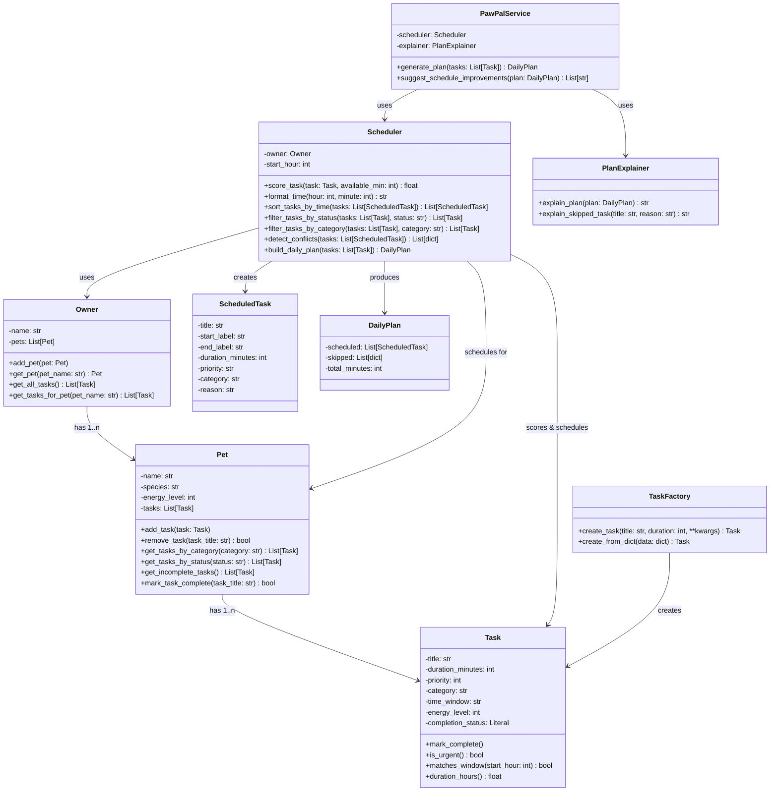

# PawPal+ System UML Class Diagram

## Architecture Overview

The PawPal+ system follows a clean **Model-View-Controller (MVC)** pattern:
- **Model Layer** (`pawpal_system.py`): Core business logic and data structures
- **View Layer** (`app.py`): Streamlit UI with session state persistence
- **Service Layer**: `PawPalService` orchestrates complex workflows

## Class Diagram (Mermaid)



## Detailed Class Specifications

### Core Data Classes

#### **Task**
Represents a single pet care task with time and priority constraints.

| Attribute | Type | Description |
|-----------|------|-------------|
| `title` | `str` | Task name (e.g., "Feeding", "Exercise") |
| `duration_minutes` | `int` | Time required (e.g., 30) |
| `priority` | `int` | Urgency level (1-10, where 10 is urgent) |
| `category` | `str` | Task type (e.g., "feeding", "play", "grooming") |
| `time_window` | `str` | Preferred time slot (e.g., "morning", "afternoon") |
| `energy_level` | `int` | Required pet energy (1-3, where 3 is high) |
| `completion_status` | `Literal["complete", "incomplete"]` | Completion state |

**Key Methods:**
- `mark_complete()` → Mark task as complete
- `is_urgent()` → Returns `True` if priority ≥ 7
- `matches_window(start_hour: int)` → Check if task fits time window
- `duration_hours()` → Return duration as decimal hours

---

#### **Pet**
Represents a single pet with an associated task list.

| Attribute | Type | Description |
|-----------|------|-------------|
| `name` | `str` | Pet's name |
| `species` | `str` | Pet type (e.g., "dog", "cat") |
| `energy_level` | `int` | Current energy state (1-3) |
| `tasks` | `List[Task]` | All associated tasks |

**Key Methods:**
- `add_task(task: Task)` → Add new task to pet
- `remove_task(task_title: str)` → Remove task by title
- `get_incomplete_tasks()` → Return list of unfinished tasks
- `get_tasks_by_category(category: str)` → Filter by category
- `get_tasks_by_status(status: str)` → Filter by completion status
- `mark_task_complete(task_title: str)` → Complete specific task

---

#### **Owner**
Manages one or more pets and provides aggregate task queries.

| Attribute | Type | Description |
|-----------|------|-------------|
| `name` | `str` | Owner's name |
| `pets` | `List[Pet]` | All owned pets |

**Key Methods:**
- `add_pet(pet: Pet)` → Add new pet
- `get_pet(pet_name: str)` → Retrieve pet by name
- `get_all_tasks()` → Aggregate all tasks across pets
- `get_tasks_for_pet(pet_name: str)` → Retrieve pet-specific tasks

---

### Scheduling & Output Classes

#### **ScheduledTask**
Represents a task placed into a specific time slot.

| Attribute | Type | Description |
|-----------|------|-------------|
| `title` | `str` | Task name |
| `start_label` | `str` | Start time (HH:MM format) |
| `end_label` | `str` | End time (HH:MM format) |
| `duration_minutes` | `int` | Duration in minutes |
| `priority` | `str` | Priority level (HIGH/MEDIUM/LOW) |
| `category` | `str` | Task category |
| `reason` | `str` | Why this task was chosen |

---

#### **DailyPlan**
Output of the scheduling algorithm containing scheduled and skipped tasks.

| Attribute | Type | Description |
|-----------|------|-------------|
| `scheduled` | `List[ScheduledTask]` | Successfully scheduled tasks |
| `skipped` | `List[dict]` | Tasks that couldn't fit with reasons |
| `total_minutes` | `int` | Total care time allocated |

---

### Algorithm Classes

#### **Scheduler**
Core scheduling engine with intelligent task allocation and filtering.

**Initialization:**
```python
Scheduler(owner: Owner, start_hour: int = 6)
```

**Key Methods:**

| Method | Returns | Purpose |
|--------|---------|---------|
| `score_task(task: Task, available_min: int)` | `float` | Weighted scoring: priority (1-10) + window match (+5) + energy fit (1-3) - duration penalty (-0.05/min) |
| `format_time(hour: int, minute: int)` | `str` | Convert to HH:MM format |
| `sort_tasks_by_time(tasks: List[ScheduledTask])` | `List[ScheduledTask]` | **NEW**: Sort chronologically by start time using HH:MM parsing |
| `filter_tasks_by_status(tasks: List[Task], status: str)` | `List[Task]` | **NEW**: Filter by "complete"/"incomplete" status |
| `filter_tasks_by_category(tasks: List[Task], category: str)` | `List[Task]` | **NEW**: Filter by task category (feeding, play, etc.) |
| `detect_conflicts(tasks: List[ScheduledTask])` | `List[dict]` | **NEW**: Detect overlapping start times and return warnings |
| `build_daily_plan(tasks: List[Task])` | `DailyPlan` | Main algorithm: allocate tasks to time slots respecting breaks |

**Scheduling Algorithm Details:**

The `build_daily_plan()` method:
1. Scores each task using weighted factors
2. Sorts by score (descending)
3. Iterates through sorted list, attempting placement in available time windows
4. Respects 15-minute breaks between tasks
5. Returns `DailyPlan` with scheduled tasks and skipped tasks with reasons

---

#### **PlanExplainer**
Provides human-readable explanations for scheduling decisions.

**Key Methods:**
- `explain_plan(plan: DailyPlan)` → Generate summary of daily plan
- `explain_skipped_task(title: str, reason: str)` → Explain why task was skipped

---

#### **TaskFactory**
Creates Task objects from various input formats (supports extensibility).

**Key Methods:**
- `create_task(title: str, duration: int, **kwargs)` → Create Task with defaults
- `create_from_dict(data: dict)` → Create Task from dictionary

---

### Service Layer

#### **PawPalService**
High-level orchestrator combining Scheduler and PlanExplainer.

**Initialization:**
```python
PawPalService(scheduler: Scheduler, explainer: PlanExplainer)
```

**Key Methods:**
- `generate_plan(tasks: List[Task])` → Generate and explain daily plan
- `suggest_schedule_improvements(plan: DailyPlan)` → Return optimization suggestions

---

## Design Patterns Used

### 1. **Separation of Concerns**
- **Data Classes** (`Task`, `Pet`, `Owner`): Model domain entities
- **Algorithm Classes** (`Scheduler`): Encapsulate scheduling logic
- **Service Class** (`PawPalService`): Orchestrate complex workflows
- **Factory Class** (`TaskFactory`): Encapsulate object creation

### 2. **Single Responsibility Principle**
- `Scheduler.score_task()` → Scoring only
- `Scheduler.build_daily_plan()` → Allocation only
- `PlanExplainer` → Explanation only
- Each class has one reason to change

### 3. **Strategy Pattern**
- `sort_tasks_by_time()`, `filter_tasks_by_*()` → Pluggable sorting/filtering strategies
- `detect_conflicts()` → Pluggable conflict detection strategy

### 4. **Composition Over Inheritance**
- `PawPalService` composes `Scheduler` and `PlanExplainer`
- No deep inheritance hierarchies

---

## Integration with Streamlit UI

**Data Persistence Pattern:**
```python
# Session state acts as persistent "vault" across page reruns
st.session_state.owner = Owner(name=owner_name)  # Persist across reruns
st.session_state.current_pet = Pet(name=pet_name, species=species)
st.session_state.tasks = []  # Task list vault
```

**UI Workflow:**
1. **Create Owner/Pet** → Instantiate and store in session_state
2. **Add Tasks** → Call `Pet.add_task()`, persist in session_state
3. **Generate Schedule** → Instantiate `Scheduler`, call `build_daily_plan()`
4. **Display Results** → Use `sort_tasks_by_time()`, `detect_conflicts()` for UI
5. **Filter/View** → Use `filter_tasks_by_*()` methods for exploration

---

## Summary

The PawPal+ architecture provides:
- ✅ **Clean MVC separation** (Model in `pawpal_system.py`, View in `app.py`)
- ✅ **Intelligent scheduling** (Multi-factor weighted scoring with time allocation)
- ✅ **Flexible querying** (Sorting, filtering, conflict detection)
- ✅ **Data persistence** (Session state across Streamlit reruns)
- ✅ **Professional explanations** (Reason for each scheduling decision)
- ✅ **Type safety** (Full type hints on all classes and methods)
- ✅ **Test coverage** (13 unit tests validating core logic)
